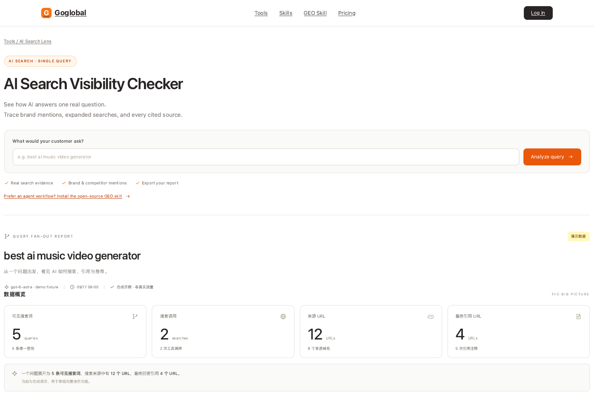
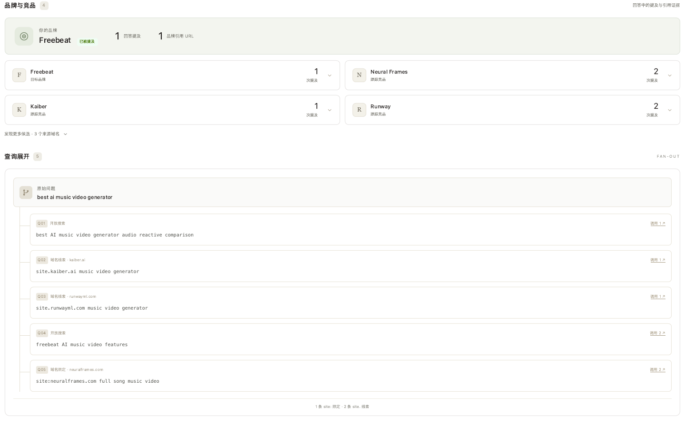
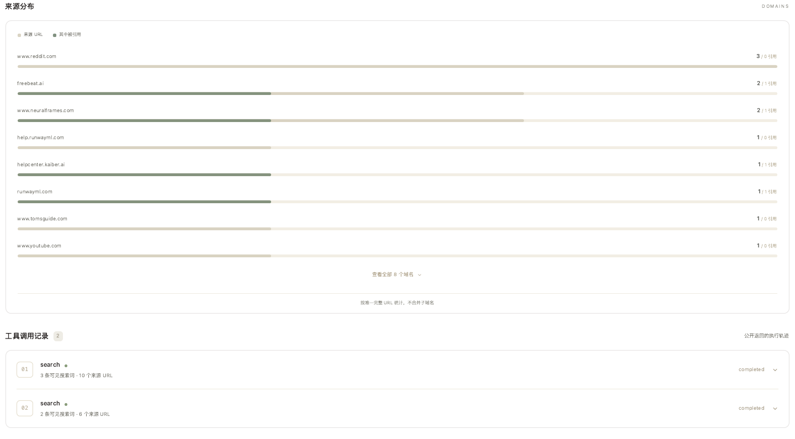
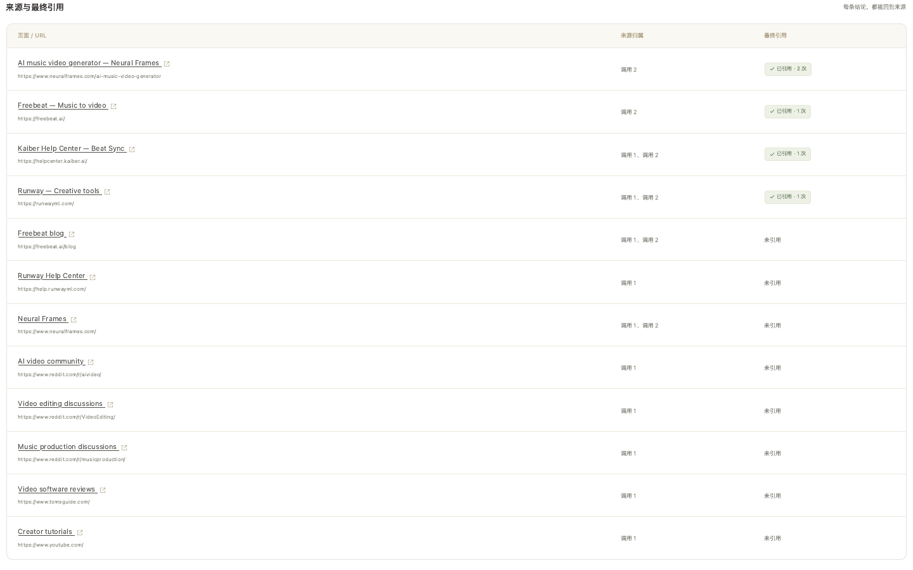

# AI Search Lens 图文使用指南

从一个客户问题出发，查看 AI 公开返回的搜索词、品牌提及、来源和最终引用，并保存可分享的研究报告。

| 入口 | 地址 | 适合什么场景 |
| --- | --- | --- |
| 在线工具 / Tool page | [goglobal.to/tools/ai-search-lens](https://www.goglobal.to/tools/ai-search-lens) | 在浏览器分析单个 query |
| GEO Skill / Skill page | [goglobal.to/skills/geo](https://www.goglobal.to/skills/geo) | 查看能力说明与安装入口 |
| Skills 聚合页 | [goglobal.to/skills](https://www.goglobal.to/skills) | 浏览 Goglobal Skills |
| 开源仓库 | [ai-search-lens-skill](https://github.com/PRCrecluse/ai-search-lens-skill) | 安装 Skill、下载代码或 Release |

> 本文配图于 2026-09-17 使用 Ego Lite 打开线上工具并导出页面后生成，展示的是**合成演示数据**，不是实际品牌表现。配图采用页面打印视图，因此不显示侧栏、筛选器和导出按钮；交互操作请在在线工具或本地界面完成。

## 1. 在线体验：从一个问题开始

打开 [AI Search Lens 工具页](https://www.goglobal.to/tools/ai-search-lens)。首页默认展示示例报告，无需 API Key 即可阅读。真实采集需要登录 Goglobal。

在 **What would your customer ask?** 输入客户可能问的问题，例如：

```text
best ai music video generator
```

点击 **Analyze query**，按弹出的研究表单填写目标品牌、域名和竞品，然后开始采集。也可以通过左侧 **新建研究** 打开表单。完成后先查看数据概览。



四个数字分别回答：AI 返回了多少搜索词、执行了多少次搜索、提供了多少来源 URL，以及最终回答引用了多少个不同 URL。**来源数不等于引用数**；同一 URL 被重复引用，也只算一个最终引用 URL。

## 2. 查看品牌提及与查询展开

在 **品牌与竞品** 中查看目标品牌是否被提及，以及回答提及次数和品牌引用 URL 数。展开品牌卡片可以读到相应文本证据。

在 **查询展开** 中，原始问题与 API 返回的搜索词按调用关联展示。点击“调用 1”等链接可以回到对应工具调用。



- `site:example.com` 表示域名限定语法。
- `site.example.com` 只作为原始域名线索展示，不改写成 `site:`。
- 品牌提及顺序不等于推荐排名；未提及只说明这一次回答中没有匹配到已配置的名称或别名。

## 3. 查看来源分布和工具调用

**来源分布** 按域名展示来源 URL 及其中被引用的 URL。**调用记录** 保留 API 公开返回的工具动作、状态、可见搜索词和来源。



一次调用可能包含多条查询，因此不能把该调用下的某个来源可靠地归到其中某一条 query。页面不会推测补全缺失字段，也不展示模型隐藏思维链。

## 4. 核对最终引用

进入 **来源与引用**，用搜索框查找域名、页面标题或 URL；用引用状态筛选只看已引用或未引用来源。点击页面标题可打开原网页。



在 **最终回答** 中核对回答原文与引用标注。示例有 12 个来源 URL，其中 4 个被最终回答引用，共出现 5 次引用注释。来源表出现某个网站，不代表 AI 推荐了该网站上的品牌。

## 5. 导出与保存

点击报告右上角 **导出报告**，按用途选择：

| 格式 | 用途 |
| --- | --- |
| HTML | 单文件报告，便于浏览器打开和分享 |
| Markdown | 保存回答及研究摘要，继续编辑 |
| 结构化 JSON | 程序读取统计、品牌、来源与引用 |
| 原始 JSON | 保留提供商返回的 Responses API 数据，便于复查和重新导入 |

在线工具的最近研究保存在当前浏览器中，不应作为唯一备份。重要报告请导出；分享前检查 query、回答和原始数据是否包含内部信息。

## 6. 安装到 Codex 或 Claude Code

需要 Node.js **22.9+**。在终端执行：

```sh
npx skills add PRCrecluse/ai-search-lens-skill
```

也可以明确指定 Agent 并全局安装：

```sh
# Codex
npx skills add PRCrecluse/ai-search-lens-skill --skill ai-search-lens --agent codex --global --yes

# Claude Code
npx skills add PRCrecluse/ai-search-lens-skill --skill ai-search-lens --agent claude-code --global --yes
```

开启新的 Agent 会话，输入：

> 使用 $ai-search-lens 研究 “best ai music video generator”，跟踪 Freebeat、Neural Frames 和 Kaiber，导出查询展开、品牌证据和引用来源的 HTML 报告。

安装包包含完整运行代码。首次使用可以让 Agent 先运行 `--demo`，再配置自己的 API 服务。查看 [Skill 页面](https://www.goglobal.to/skills/geo) 或 [README](../README.md) 中的更新、Git 安装和 Release 下载命令。

## 7. 下载后直接用命令行运行

```sh
git clone https://github.com/PRCrecluse/ai-search-lens-skill.git
cd ai-search-lens-skill

# 无 API Key 的合成示例
node runtime/scripts/research.mjs --demo --out ./reports/demo

# 本地交互界面：http://127.0.0.1:4317
cd runtime
npm start
```

无需额外安装 npm 依赖。示例命令在指定目录生成 `report.html`、`report.json`、`answer.md`、`response.json` 和 `config.json`。再次使用同一个 `--out` 目录会替换其中同名报告文件。

### 真实采集

在仓库根目录执行：

```sh
cp runtime/.env.example runtime/.env
```

编辑 `runtime/.env`，填写自己的 `OPENAI_API_KEY`。`OPENAI_MODEL` 选择账号支持且可调用网络搜索工具的模型，`OPENAI_BASE_URL` 可指定兼容的 Responses API 服务。不要把真实 Key 提交到仓库。

```sh
cd runtime
npm run report -- \
  --query "best ai music video generator" \
  --brand Freebeat \
  --domain freebeat.ai \
  --competitors "Neural Frames,Kaiber" \
  --out ./reports/music
```

真实调用由自己的 API 服务商计费。在线 Goglobal 登录与本地 API 配置互相独立；本地运行不会自动获得网站的 API 配额。

### 导入已有响应

在仓库根目录执行，`--input` 指向原始 Responses API JSON（含 `output` 数组），不是结构化 `report.json`：

```sh
node runtime/scripts/research.mjs \
  --input /absolute/path/response.json \
  --query "原始问题" \
  --brand Freebeat \
  --domain freebeat.ai \
  --out ./reports/imported
```

导入不会调用模型。复杂的品牌域名或别名配置可以通过 `--config` 传入，格式见 [数据契约](../references/data-contract.md)。

## 常见问题

**为什么没有查询展开或来源？** 提供商必须支持 Responses API 网络搜索，并公开返回相应字段。没有返回的数据会显示为缺失；工具不会编造搜索过程。

**为什么与 ChatGPT 网页结果不同？** 模型、时间、工具配置和个性化上下文可能不同。本报告记录的是本次 API 响应。

**这能代表总体 GEO 可见率吗？** 不能。单次 query 是一份证据快照；总体可见率需要固定问题集、时间范围和重复采样。

**哪里下载完整包？** [最新 Release](https://github.com/PRCrecluse/ai-search-lens-skill/releases/latest) 提供 ZIP、tar.gz 和 SHA-256 校验文件。[README](../README.md#命令行下载--release) 提供命令行下载步骤。
